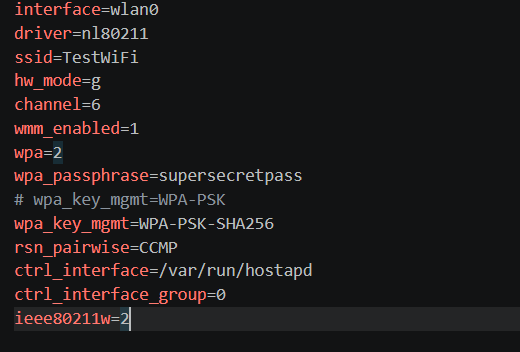
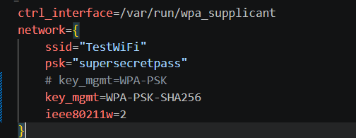
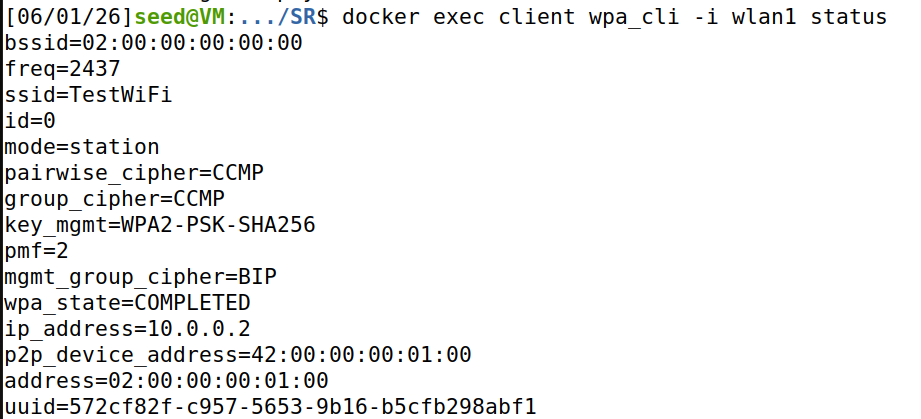
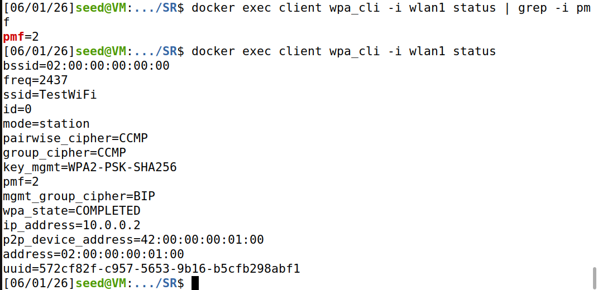
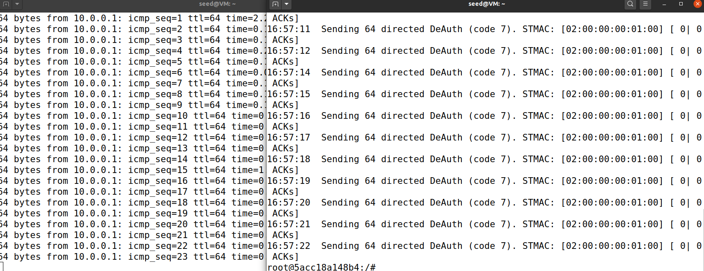

# Defeating Deauthentication Attacks with PMF (802.11w)

This guide demonstrates how to configure Protected Management Frames (PMF) in a virtualized 802.11 lab and shows how it effectively neutralizes standard deauthentication attacks.

## Step 1 - Enable PMF on the Access Point

Edit `hostapd.conf` (or your specific hostapd configuration file) and modify it to include the PMF settings:



### Configuration Notes

- `ieee80211w=2` strictly requires PMF for all connections.
- `wpa_key_mgmt=WPA-PSK-SHA256` is the PMF-compatible Authentication and Key Management (AKM) suite. Plain WPA-PSK can coexist with `ieee80211w=1`, but for `=2`, the SHA-256 variant is required.
- `rsn_pairwise=CCMP` means TKIP is fundamentally incompatible with PMF.

## Step 2 - Enable PMF on the Client

Edit `client.conf` to look like this:



Setting `ieee80211w=2` ensures the client will refuse to connect to any AP that does not offer Protected Management Frames.

## Step 3 - Restart the Lab

Apply the new configurations by restarting the Docker containers:

```bash
./start.sh
```

Confirm that the client associated successfully:

```bash
docker exec client iw dev wlan1 link
```

You should see `Connected to 02:00:00:00:00:00, SSID: TestWiFi`.

Verify PMF is actively running on the AP:

```bash
docker exec ap hostapd_cli -i wlan0 get_config
```

Expected output:

```text
key_mgmt=WPA-PSK-SHA256
group_cipher=CCMP
rsn_pairwise_cipher=CCMP
pmf=2
```


Verify PMF is actively running on the client:

```bash
docker exec client wpa_cli -i wlan1 status | grep -i pmf
```


## Step 4 - Execute the Attack

In the attacker container, start a fresh packet capture:

```bash
docker exec -it attacker bash
mkdir -p /tmp/capture-pmf
cd /tmp/capture-pmf
airodump-ng -c 6 --bssid 02:00:00:00:00:00 -w handshake wlan2
```

The AP row should now show the MFP column populated. Depending on your `airodump-ng` version, the cipher column may read `CCMP CMAC` (CMAC is the Broadcast Integrity Protocol cipher used to sign management frames).

In a second attacker terminal, launch the exact same deauthentication attack as before:

```bash
aireplay-ng --deauth 20 \
    -a 02:00:00:00:00:00 \
    -c 02:00:00:00:01:00 \
    wlan2
```

`aireplay-ng` will transmit the frames exactly as it normally would. However, the client will ignore them.


## Step 5 - Verify Handshake Capture Failure

Because the client never disconnected, no reconnection occurred, and no 4-way handshake was generated.

Stop `airodump-ng` and attempt to crack the capture file:

```bash
aircrack-ng /tmp/capture-pmf/handshake-01.cap
```

Expected result:

```text
#  BSSID              ESSID      Encryption
1  02:00:00:00:00:00  TestWiFi   WPA (0 handshake)
```


The attack chain is successfully broken.

## Step 6 - Wire-Level Confirmation

Inspect the forged deauth frames in the packet capture to see why the client rejected them:

```bash
tshark -r /tmp/capture-pmf/handshake-01.cap \
       -Y "wlan.fc.type_subtype == 0x0c" \
       -V | grep -E "Protected|MIC|deauth"
```

A legitimate deauthentication frame from a PMF-enabled AP would have the Protected flag set to `1` and contain a valid MMIC trailer. Because `aireplay-ng`'s spoofed frames lack these cryptographic signatures, the client's 802.11 stack securely discards them.